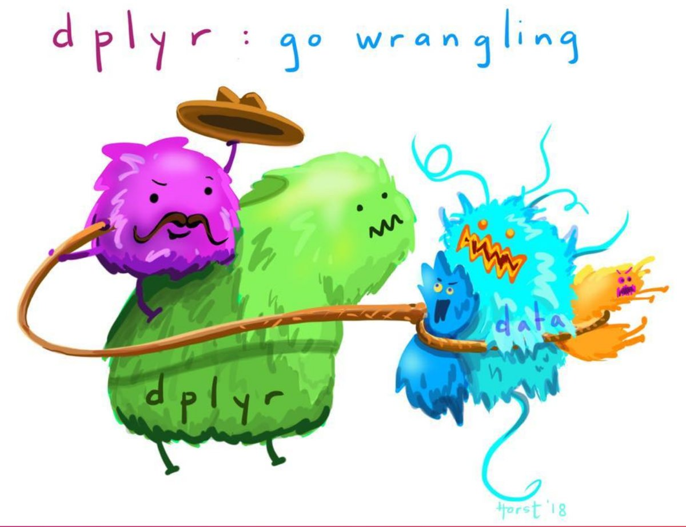

*FIRST*: Many thanks to An Bui & Sam Csik's `tidyverse` [tutorial](https://github.com/samanthacsik/Intro-to-the-Tidyverse), Dr. Simona Picardi's `tidyverse` [chapter](https://ecorepsci.github.io/reproducible-science/tidyverse.html), & Dr. Alison Horst's `tidyverse` [aRt](https://github.com/allisonhorst/stats-illustrations) which helped immensely in preparing this document.

# Data Wrangling with the `tidyverse`

### What is the `tidyverse`?

<center>


</center>

The `tidyverse` is the bread and butter of data tidying, cleaning, organizing, and manipulating. It's a toolkit designed for [data science](https://r4ds.had.co.nz/introduction.html) that opens up our world to simple collaboration and robust reproducibility. Because all of the packages contained within the `tidyverse` share an underlying philosophy, grammar, and data structure, it's easy to streamline data manipulation and visualization with confidence across multiple, unrelated datasets. Read more about this incredible toolkit [here](https://www.tidyverse.org/).

The *core* `tidyverse` collection includes the following packages:

* `dplyr` for data manipulation;
    + **primary functions**: arrange(), filter(), group_by(), mutate(), select(), summarize()
* `tidyr` for transforming data to a tidy format;
    + **primary functions**: gather(), spread()
* `readr` for reading in rectangular data (e.g., .csv);
    + **primary functions**: read_csv(), readRDS()
* `ggplot2` for plotting/graphics;
    + there is **SO MUCH** to cover, here; [this](https://r4ds.had.co.nz/data-visualisation.html) is a good place to start (Wickam & Grolemund 2017)
* `stringr` for manipulating character strings;
    + **primary functions**: str_detect(), str_count(), str_subset(), str_extract(), str_replace(), str_match(), str_split()
* `tibble` for re-engineered alternatives to data frames;
    + **primary functions**: as_tibble(), tibble()
* `purr` for functional programming;
    + **primary functions**: map()
* `forcats` for working with categorical variables;
    + **primary functions**: fct_reorder(), fct_infreq(), fct_relevel(), fct_lump()
* `magrittr` for sequential modification of a data frame;
    + **primary functions**: %>%

These core packages are loaded automatically with `library(tidyverse)`. There are many other packages with specialized uses included in the `tidyverse()` suite that are not automatically loaded, and must be loaded separately with `library(package_name)`. We covered various of these specialized packages when we discussed R's data import capabilities (e.g., `readxl` for .xls and .xlsx sheets, `haven` for SPSS, STATA, and SAS data).

Though these packages must be loaded into our environment separately, they again, share common grammar, syntax, and data structures, which facilitates programming across them and integrating them into common workflows. 

### Load the tidyverse()
```{r}
## install.packages("tidyverse")
library(tidyverse)
```


### Data wrangling cheat sheet:

Below are reproducible examples of commonly used tidyverse functions.

Let's first create some completely hypothetical data about the number of times we have each skied at Beaver over the past four years!

```{r}
# NOTE: this data is NOT tidy (i.e. in wide format, where each row represents three observations, not one)
beaver_data <- tribble(
  ~name,    ~`2017`,   ~`2018`,   ~`2019`, ~`2020`, # R doesnt' love vars named as numbers, so wrap them in backquotes! 
  "Britta",       25,        20,        16,        27,   # or avoid the problem by beginning var names with characters 
  "Mark",        20,        15,        11,        12,   # (e.g. "year_2017")
  "Sarah",   18,        17,        10,        8,
  "Dakoeta",     19,        10,        14,        22,
  "Ellie",     34,        15,        9,        17,
  "Erika",     21,        13,        14,        11,
  "Alex",     23,        29,        16,        7
  )
```


It's a **REALLY** good habit to **ALWAYS** explore your data before starting to wrangle it; form this habit, now (you'll thank yourself down the line!):
```{r, eval = FALSE}
str(beaver_data) # view data structures of beaver_data; i.e. what is the type (e.g., character, numeric, factor) of each of the columns
colnames(beaver_data) # view column names of beaver_data
head(beaver_data) # view first 10 rows of beaver_data 
```


Before we do anything else, we'll first want to transform 'beaver_data' into a [tidy](https://r4ds.had.co.nz/tidy-data.html) (long) format. [Tidy data](https://www.openscapes.org/blog/2020/10/12/tidy-data/) follows three general rules: 1) variables are in columns (THINK: YEAR, AGE, INCOME, etc.), 2) observations are in rows (THINK: COUNTY, RESPONDENT,), and 3) values are in cells (THINK: COUNT, USD$, CATEGORIES). Having tidy data allows us to use the same tools in similar ways for different datasets... which means we don't have to reinvent the wheel every time we do analyses, but can translate code/knowledge about toolsets to perform similar tasks on different data. We can't do this with messy data.

<center>


</center>

**pivot_longer()** transforms data from untidy, wide, to long format (NOTE: this function updates `gather()`, which is no longer under active development)
```{r}
tidy_beaver <- beaver_data %>% 
  pivot_longer(cols = c(`2017`, `2018`, `2019`, `2020`), names_to = "year", values_to = "ski_days")
```


Conversely, you can transform 'tidy_beaver' back to wide format. 

Most R functions prefer long format, tidy data, hence the "tidy" in `"tidy"verse()`, and long format data typically eases data processing, but there are cases where wide format data is preferred (e.g., visualizing data in tables for human comprehension): 

**`pivot_wider()`** transforms data from long to wide format (NOTE: this function updates `spread()`, which is no longer under active development)
```{r}
# let's convert our 'tidy_beaver' data back to wide format using spread()
back_to_wide <- tidy_beaver %>% 
  pivot_wider(names_from = year, values_from = ski_days)
```


From here on, we'll be working with our **tidy data** i.e. **`tidy_beaver`** to practice some useful wrangling functions. But first, an interlude about [wrangling](https://rstudio.com/wp-content/uploads/2015/02/data-wrangling-cheatsheet.pdf). 

[Data wrangling](https://r4ds.had.co.nz/wrangle-intro.html) refers to the art of getting your data into R in a useful form for visualization and modeling. & it is *definitely* an art...and a science...and sometimes takes some brute force. It can be a LOT of work; a LOT of HARD work. But `tidyverse()`  and our use of tidy datasets have made this work MUCH, MUCH more predictable and user-friendly.

<center>


</center>

### Subsetting data: 

**`select()`** selects columns to retain and specifies their order in the data.frame()
```{r}
names_beaver <- tidy_beaver %>% 
  select(name, ski_days)
```


**`filter()`** selects observations within columns given some criteria
```{r}
britta_mark <- tidy_beaver %>% 
  filter(name == "Britta" | name == "Mark") # "|" tells R to filter any observations that match "Britta" OR "Mark"

britta_mark_alt <- tidy_beaver %>% 
  filter(name %in% c("Britta", "Mark")) # another way of filtering; this is nice if you want to filter through many unique column attributes

not_britta <- tidy_beaver %>% # 
  filter(name != "Britta") # != tells R to filter any observations that DO NOT match "Britta"
```


**`pull()`** pulls out a single variable from a data frame and saves it as a vector
```{r}
ski_days_vec <- tidy_beaver %>% 
  pull(ski_days)
```

### Manipulating/adding variables:


**`arrange()`** orders observations as specified (*default* = alphabetical or ascending)
```{r}
ordered_names <- tidy_beaver %>% 
  arrange(name) # for descending alphabetical order, use "arrange(desc(names))"

ordered_num_skidays <- tidy_beaver %>% 
  arrange(ski_days) # for descending order, use "arrange(-ski_days)"
```


**`rename()`** renames a column
```{r}
renamed_beaver <- tidy_beaver %>% 
  rename(total_skidays = ski_days)
```


**`mutate()`** is SUPER versatile function; it can be used to calculate a new value using existing observations and place this value in a new column, it can be used to add a column based on existing observations, to coerce a variable to a different type, etc. Below are a few examples of its usefulness!
```{r}
# use mutate() to calculate a new value using existing observations and add this new value to a new column
skidays_per_month <- tidy_beaver %>% # assuming there are 6 months in the ski season
  mutate(skidays_per_month = ski_days/6)

# use mutate in conjunction with case_when to add a column based off existing observations
fav_skidays <- tidy_beaver %>% 
  mutate(
    fav_skidays = case_when(
      name == "Britta" ~ "Fresh Pow",
      name == "Mark" ~ "Groomer",
      name == "Sarah" ~ "Blue Bird",
      name == "Ellie" ~ "Ungroomed",
      name == "Dakoeta" ~ "Fresh Pow",
      name == "Erika" ~ "Fresh Pow",
      name == "Alex" ~ "Blue Bird"
    )
  )

# use mutate in conjunction with ifelse, where if the observation in the 'name' column matches "Britta", "Erika", or "Sarah", report "yes", they are snowboarders. If not, report "no", they are skiers.
snowboarder <- tidy_beaver %>% 
  mutate(snowboarder = ifelse(name %in% c("Britta", "Erika", "Sarah"), "yes", "no")) 

# use mutate() to coerce a variable to a different data type
name_as_factor <- tidy_beaver %>% 
  mutate(name = as_factor(name)) # you can check that this worked by viewing 'str(name_as_factor)'
```

### Summarizing data: 


**`group_by()`** groups observations such that data operations are performed at the level of the group; this is SUPER useful if you want to complete analyses by age class, or year, for instance.
```{r}
grouped_names <- tidy_beaver %>% 
  group_by(name) # notice that nothing appears to change when you view 'grouped_df.' Grouped data is sort of a phantom phenom, the data sits grouped under the hood, but doesn't appear as such in any R interface. Not until you preform some sorta function with the grouped data.... See the summarize() function below.
```


**`summarize()`** calculates summary statistics; this is also SUPER useful. Wanna find the mean? Median? Mode? Minimum? Maximum? Sandard deviation? summarize() has your back!
```{r}
beaver_summary <- tidy_beaver %>% 
  group_by(name) %>% 
  summarize(
    avg_skidays = mean(ski_days), # feel free to substitute any summary stat function here!!
    max_skidays = max(ski_days),
    min_skidays = min(ski_days) # and add as many as you want to calculate!
  )
```


**`tally()`** sums values across groups; use this function to find 'n'
```{r}
tallied_beaver <- tidy_beaver %>% 
  group_by(name) %>% 
  tally(ski_days)
```


# Now let's practice on some REAL*ish* data!

### Load the tidyverse and any additional required packages:
```{r}
#install.packages("DALEX")
library(DALEX)

data(dragons)
view(dragons)
```

In honor of [Black Dragon Canyon Wash](https://www.alltrails.com/trail/us/utah/black-dragon-wash-trail--3) Let's pretend we're trying to understand how different species of chromatic dragons (a decently [tempermental](https://en.wikipedia.org/wiki/Dragon_(Dungeons_%26_Dragons)#:~:text=A%20Chromatic%20dragon%20is%20a,are%20typically%20of%20good%20alignment.&text=Tiamat%20is%20the%20queen%20of,all%20dragons%20from%20Babylonian%20mythology.) critter) with various life lengths compare in terms of number of scars and BMI. 

### Explore: 

We should first familiarize ourselves with the data. 

```{r, eval = FALSE}
dim(dragons) # view dimensions of the df
head(dragons) # view first 10 rows of df
tail(dragons) # view last 10 rows of df
str(dragons) # view data structure of df
colnames(dragons) # view the columns of df
```

### Wrangle:

This dataset is **pretty big**--we'll want to wrangle it so that it only includes the information that we're interested in. We will:

a. filter for black & blue dragons  
b. select relevant columns of data 
c. rename columns  
d. create new columns  
e. combine genus and species into a single column
f. create categorical variable to group dragons by age!

To demonstrate these individual steps, we'll perform each function separately. Notice that we perform subsequent function calls on the data frame generated from the prior step. At the end, we'll show you how to combine all steps into a single, succint code chunk. Creating efficient workflows but combining multiple data wrangling steps is one of the great POWERS of tidyverse()!

#### a. filter for black & blue dragons

This dataset has information on dragons of four different colors, we we are interested only in black & blue dragons. First, we'll filter only for black and blue dragons.

```{r}
black_and_blue <- dragons %>% 
  filter(colour %in% c("black","blue"))
```

#### b. select the columns we want

Let's select only the columns we're interested in.

```{r}
select_columns <- black_and_blue %>% 
  select(2:5,7, life_length) # you can supply a range of columns, or specify them individually
```

#### c. rename columns

To make this even more manageable, we can change column names to something easier (i.e. shorter to type). For example:

```{r}
rename_columns <- select_columns %>% 
  rename(teeth = number_of_lost_teeth,
         age = life_length)
```

#### d. create new columns

We can also create new columns:

1) based conditionally on other columns; OR,
2) by preforming some calculation. 

```{r}
# conditional column addition
genus_species <- rename_columns %>% 
  mutate(genus = ifelse(colour %in% c("blue"), "Sauroniops", "Jaggermeryx"),
         species = case_when(
              colour == "blue" & age < 1200 ~ "reike",
              colour == "blue" & age > 1200 ~ "naida",
              colour == "black" & age < 1000 ~ "ozzyi",
              colour == "black" & (age >= 1000 & age <= 1700) ~ "whido",
              colour == "black" & age > 1700 ~ "strummeri"))

# preform some operation/calculation
BMI <- genus_species %>% 
  mutate(BMI = (weight*2000)/0.45359237 / height^2)
```

#### e. combine the `genus` and `species` into a single column.

```{r}
unite_columns <- BMI %>% 
  unite(genus_species, genus, species, sep = " ") # sep = "_" is the default
```

#### f. create categorical variable to group dragons by age!

```{r}
cat_age <- unite_columns %>% 
  mutate(age_group = as.factor(case_when(
              age < 1000 ~ "dragonling",
              age >= 1000 & age <= 2000 ~ "jouvenile",
              age > 2000 ~ "adult")))
```


#### Now let's pull all of these steps together!

We split each wrangling step up into a separate data frame, but you could have linked all these functions together in one chunk using the pipe operator, like this:

```{r}
dragons_simple <- dragons %>% 
  filter(colour %in% c("black","blue")) %>% 
  select(2:5,7, life_length) %>%  
  rename(teeth = number_of_lost_teeth,
         age = life_length) %>% 
  mutate(genus = ifelse(colour %in% c("blue"), "Sauroniops", "Jaggermeryx"),
         species = case_when(
              colour == "blue" & age < 1200 ~ "reike",
              colour == "blue" & age > 1200 ~ "naida",
              colour == "black" & age < 1000 ~ "ozzyi",
              colour == "black" & (age >= 1000 & age <= 1700) ~ "whido",
              colour == "black" & age > 1700 ~ "strummeri")) %>% 
  mutate(BMI = (weight*2000)/0.45359237 / height^2) %>% 
  unite(genus_species, genus, species, sep = " ") %>% 
  mutate(age_group = as.factor(case_when(
              age < 1000 ~ "dragonling",
              age >= 1000 & age <= 2000 ~ "jouvenile",
              age > 2000 ~ "adult")))

# save data
saveRDS(dragons_simple, "./out-data/dragons-tidy.RDS")
```

With this simplified and cleaned data set, we're ready to explore! Let's first isolate data we want to visualize by:

a. grouping observations by age_group & genus_species
b. finding the average scars, BMI, and number of teeth for each species-age combination
c. pivot_longer() into tidy format for visualizing

```{r}
fav_spp <- dragons_simple %>% 
  group_by(age_group,genus_species) %>% 
  summarise(ave_scars = ave(scars),
            ave_BMI = ave(BMI),
            ave_teeth = ave(teeth)) %>% 
  distinct() %>% 
  pivot_longer(cols = c(`ave_scars`, `ave_BMI`, `ave_teeth`), names_to = "summary_var", values_to = "ave")
```

### Plot:

Now that we have our data summarised and in tidy format, we're ready to make a plot! We want to:

a. create a column graph showing the summarised by species and by age_group
b. create a different panel for each dragon species
c. make it pretty

**Note:** Only the first 3 lines of the following code are necessary to make the plot. Everything else simply modifies the appearance and make it a bit more presentable. There are *tons* of ways to customize plots -- we explore only a few options below.

```{r, fig.align = 'center', fig.width = 15, fig.height = 10}
library(ggplot2)

ggplot(fav_spp, aes(x = age_group, y = ave, fill = summary_var)) + # fill = counts of each phenophase
  geom_col(position = "dodge") + # separate columns for each phenophase (instead of stacked)
  facet_wrap(~genus_species) + # create separate panels for each species
  ggtitle("Chromatic dragon traits") +
  labs(x = "Age Group", y = "", fill = "Summary Variable") +
  scale_fill_manual(labels = c("Average BMI", "Average Scars", "Average Teeth Lost"), values = c("darkseagreen3", "cadetblue", "orange")) + # change colors
  theme_bw() + 
  theme(panel.border = element_rect(colour = "black", fill = NA, size = 0.7), 
        axis.text.x = element_text(angle = 45, hjust = 0.9))

ggsave("./out-plots/dragon_plot.png", dpi = 300)

```
