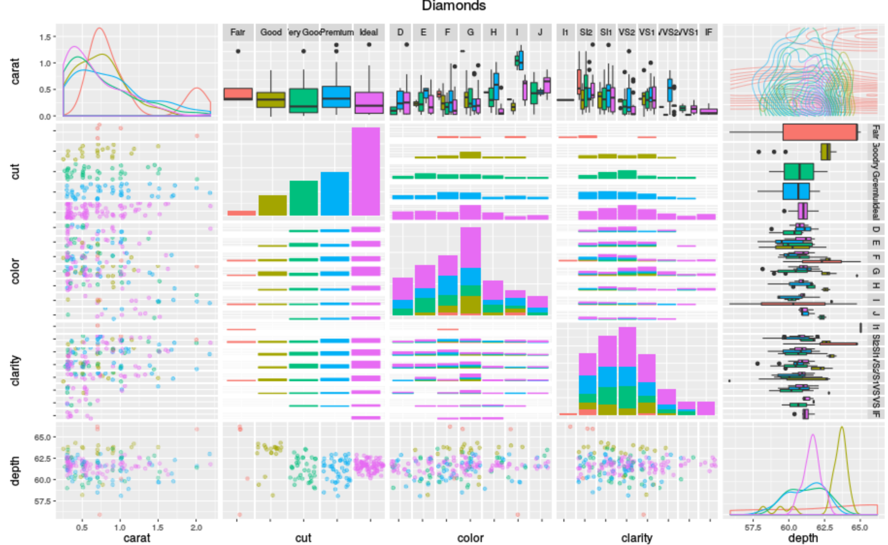

*FIRST*: Many thanks to Alison Horst for her gorgerous [aRt](https://github.com/allisonhorst/stats-illustrations).

# Data Visualization with ggplot2()

### What is ggplot2()?

<center>


</center>

`ggplot2()` is the bread and butter of data visualization; it takes clean, organized, manipulated data, and (with your direction) builds beautiful, & more importantly, *communicative*, plots. `ggplot2` is based on the *grammar of graphics*, which asserts that we can build every graph from the same few components: 1) a clean and tidy **data set**; 2) a set of **geoms** that map out data points; and 3) a **coordinate system** (in the broadest sense; ie. how will the data be mapped onto a graphical surface). To actually display data values, we map out our variables to aesthetic things like **size**, **color**, and **x** and **y** locations; we also tell `ggplot2` the type of visualization we are interested in building (e.g., bar graph, box plot, line graph, density plots, etc.). `ggplot2` opens up [data science](https://r4ds.had.co.nz/introduction.html) to broader audiences and helps all of us communicate our science. Download [this](https://www.rstudio.com/wp-content/uploads/2015/03/ggplot2-cheatsheet.pdf) cheat sheet and save it somewhere accessible--it's an incredible tool to refer back to!

`ggplot2` works with  `data.frames`, the data type we built in our previous `tidyverse` workshop. The data we feed into `ggplot2` consists of rows and columns that "live peacefully" together in a tidy `data.frame`. This means, often, we need to do some data cleaning up front to get our data into the **tidy** format we need for visualization.

# Let's get started on some REAL*ish* data!

### Load the tidyverse and any additional required packages:
```{r warning = FALSE, message = FALSE}
#install.packages("DALEX")
library(tidyverse)
library(DALEX)
library(RColorBrewer)

data(dragons)
view(dragons)
```

In honor of [Black Dragon Canyon Wash](https://www.alltrails.com/trail/us/utah/black-dragon-wash-trail--3) Let's pretend we're trying to understand how different species of chromatic dragons (a decently [tempermental](https://en.wikipedia.org/wiki/Dragon_(Dungeons_%26_Dragons)#:~:text=A%20Chromatic%20dragon%20is%20a,are%20typically%20of%20good%20alignment.&text=Tiamat%20is%20the%20queen%20of,all%20dragons%20from%20Babylonian%20mythology.) critter) with various life lengths compare in terms of number of scars and BMI. 

### Explore

We should first familiarize ourselves with the data. 

```{r, eval = FALSE}
 # view dimensions of the df
 # view the data structure and first few observations
 # view data structure of df
 # view the columns of df
```

### Wrangle

Let's quickly brush up on wrangling and clean up this data set for our purposes. We will:

a. filter for black & blue dragons  
b. select relevant columns of data 
c. rename columns  
d. create new columns  
e. combine genus and species into a single column
f. create categorical variable to group dragons by age!

Let's create an efficient workflow by combining **ALL** of these data wrangling steps into one; ie. let's review harnessing the great POWERS of `tidyverse()`!

#### Now let's pull all of these steps together!

We split each wrangling step up into a separate data frame, but you could have linked all these functions together in one chunk using the pipe operator, like this:

```{r}
# recall how we clean and manipulate data
dragons_simple <- dragons %>% 
   # filter for blue & back dragons
   # select only relevant columns (height, weight, scars, colour, number_of_lost_teeth, and life_length)
   # rename columns with terribly long names
  mutate(genus = , # create new column, genus, based on color; if blue = Sauroniops, if black = Jaggermeryx
         species = case_when(
              colour == "blue" & age < 1200 ~ "reike",
              colour == "blue" & age > 1200 ~ "naida",
              colour == "black" & age < 1000 ~ "ozzyi",
              colour == "black" & (age >= 1000 & age <= 1700) ~ "whido",
              colour == "black" & age > 1700 ~ "strummeri")) %>% # create species column based on colour and age
  # create new column, BMI (formula = (weight*2000)/0.45359237 / height^2)
  # combine genus and species
  mutate(age_group = as.factor(case_when(
              age < 1000 ~ "dragonling",
              age >= 1000 & age <= 2000 ~ "jouvenile",
              age > 2000 ~ "adult"))) # create categorical variables to group dragons by age

# recall how we save data

```

With this simplified and cleaned data set, we're ready to explore! Let's first isolate data we want to visualize by:

a. grouping observations by age_group & genus_species
b. finding the average scars, BMI, and number of teeth for each species-age combination
c. pivot_longer() into tidy format for visualizing

```{r}
fav_spp <- dragons_simple %>% 
  # group by age group and species
  # summarise average scars, BMI, and teeth lost
  # keep only distinct observations
  # pivot_longer() to format for column graph
```

### Column graph

Now that we have our data summarised and in tidy format, we're ready to make a plot! We want to:

a. create a column graph showing the summarised by species and by age_group
b. create a different panel for each dragon species
c. make it pretty

**Note:** Only the first 3 lines of the following code are necessary to make the plot. Everything else simply modifies the appearance and make it a bit more presentable. There are *tons* of ways to customize plots -- we explore only a few options below.

```{r, fig.align = 'center', fig.width = 15, fig.height = 10}
# fill = summary variables
  # separate columns for each age group
  # create separate panels for each species
  # add a title
  # add labels on the axes and legend
  # change colors and names
  # change the theme
  # change the border color and size
        # change the angle of the x axis text, change the horizontal adjustment
  # save the plot

```

### Line graph

Let's visualize this data in a different way; Let's:

a. create a line graph that shows how height and weight relate by species, and let's only filter for rare species (ie., NOT 	
Sauroniops naida or Sauroniops reike)
b. make it pretty

```{r fig.align = 'center', fig.width = 15, fig.height = 10}

  # separate columns for each age group
  # scale dots based on BMI
  # add a title
  # add labels on the axes and legend
  # change colors and names
  # change the theme
  # save the plot

```

### Histogram

Let's visualize this data in a different way; Let's:

a. create a histogram that shows the range of teeth lost by species
b. make it pretty
```{r}

# make a boxplot
  # give the graph labels
  # change the theme
  # use a preset palette
  # adjust the angle of the x axis text
  # move legend to the bottom
  # give legend two rows
  # save the plot

```

### Plots, plots, plots, plots, plots, plots, plots!

There are just about a bazillion different ways to visualize the same data:

<center>



</center>

... In the end we just have to choose the method that makes the most sense for our audience, our research questions and our data!

Additionally, aRtists everywhere are using R to make ridiculously cool pieces of [generative](https://en.wikipedia.org/wiki/Generative_art) and patterned art. Check out some talented RLadies [here](https://ijeamaka-anyene.netlify.app/) and [here](https://djnavarro.net/projects/)! Plus, [#TidyTuesday](https://github.com/rfordatascience/tidytuesday) submissions can be [absolutely](https://tanyadoesscience.com/project/tidytuesday/), [wildly](https://martindevaux.com/2021/01/tidytuesday-art-collections/), [brilliantly](https://codingwithavery.com/posts/2020-08-12-tidy-tuesday-avatar/), good.

# Bonus

What's *especially* neat about `ggplot2` is that it interfaces seamlessly with `sf`, a package for spatial data wrangling, analysis, and viz.`sf` treats its spatial objects as `data.frames` meaning.... we can use all of the magic & power of the `tidyverse` to play with the data! Plus, these data look just like any other data.frame, except attached to them is a column `geometry` that houses the coordinate information for the observation!

Below, we'll take the the EPA air quality data Ellie & Dakoeta gathered and make it spatial for visualization!

```{r warning = FALSE}
# install.packages("sf") # if you haven't done so already!
library(sf)

# read in the data
epa <- readRDS("./in-data/alldata_1980_2020.RDS")

# let's explore a bit
# view dimensions of the df
# view the data structure and first few observations
# view data structure of df
# view the columns of df

# give this data.frame real dates!
dates <- data.frame(str_split_fixed(epa$date_local, "-", n = 3)) %>%
  rename(year = X1,
         month = X2,
         day = X3)

# bind year, month, day columns to epa data.frame
epa <- bind_cols(dates, epa)

# build_spatial 
epa_sf <- st_as_sf(x = epa, 
                        coords = c("longitude", "latitude"),
                        crs = "+proj=aea +lat_0=0 +lon_0=-120 +lat_1=34 +lat_2=40.5 +x_0=0 +y_0=-4000000 +datum=NAD83 +units=m +no_defs")

glimpse(epa_sf) # notice the new column, geometry

# visualize

```

There are many, many ways to make maps beautiful in `ggplot` using `sf`. Anyone who says R isn't built for spatial viz just hasn't tried hard enough--check out [this](https://timogrossenbacher.ch/2019/04/bivariate-maps-with-ggplot2-and-sf/) if you don't believe me (just about the most gorgeous, creative, and well-built map I've ever seen).

# Resources
* Emily Burchfield's data viz materials, [here](https://www.emilyburchfield.org/courses/data_viz/intro_to_ggplot_tutorial).
* [Secrets of a happy graphing life](https://stat545.com/secrets.html).
* [The ggplot2 cheatsheet!](https://www.rstudio.com/wp-content/uploads/2015/03/ggplot2-cheatsheet.pdf)
* Chapters 5 - 12 in [this online textbook](https://clauswilke.com/dataviz/visualizing-amounts.html) provide a great overview of when to use different visualization strategies.